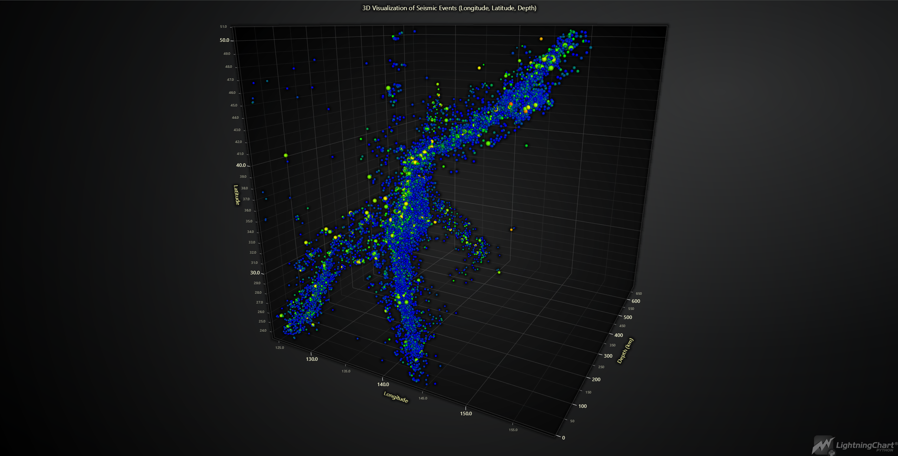
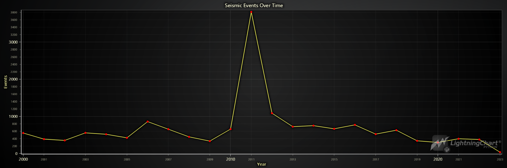
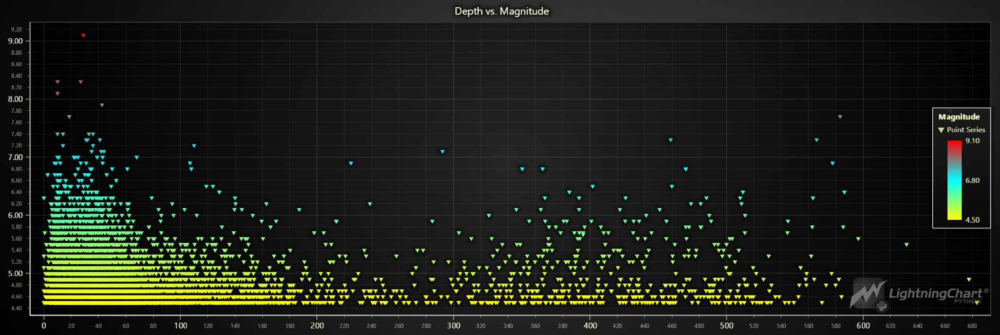
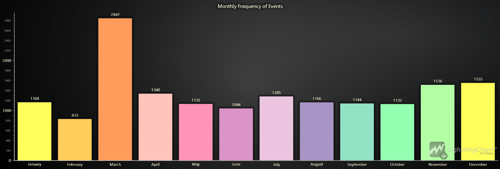
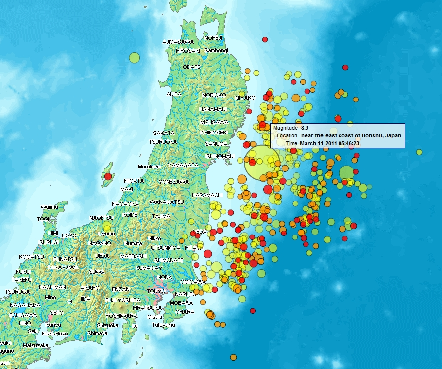
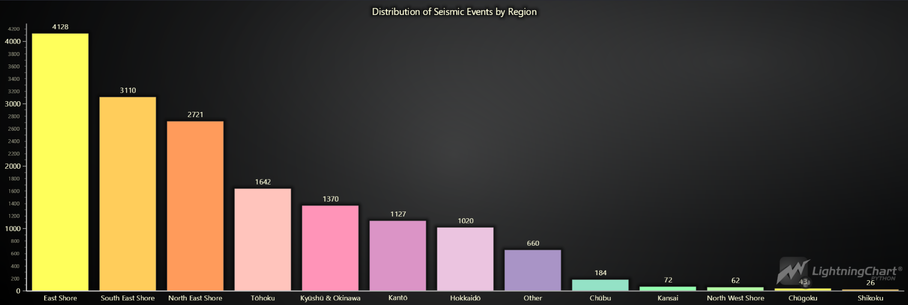
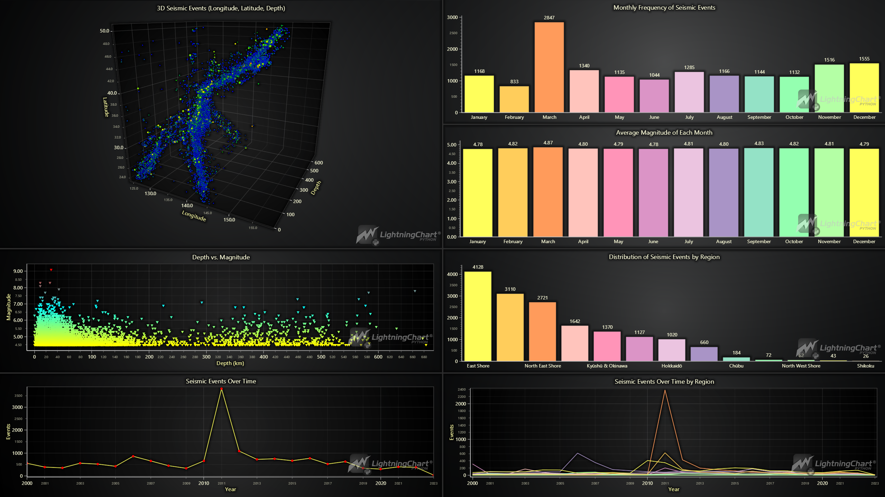

# Analyzing Japan's Seismic Events (2000-2023) with LightningChart Python

## Introduction

Japan is one of the most seismically active regions in the world, and analyzing seismic events is critical for understanding patterns and improving preparedness. This project focuses on visualizing and analyzing seismic events in Japan from 2000 to 2023 using LightningChart Python, a powerful tool for creating interactive visualizations.

### LightningChart Python's Usability for This Project

LightningChart Python offers advanced features for creating detailed and interactive charts, particularly useful for visualizing complex datasets like seismic events. Its performance and capabilities make it an excellent choice for this type of analysis, allowing us to explore the data in depth and uncover meaningful trends.

## Setting up Python Environment

### Installing Python and Necessary Libraries

To get started, you'll need Python installed on your system, along with the necessary libraries. You can install the required libraries using `pip`:

```bash
pip install pandas lightningchart
```

### Overview of Libraries

- **[Pandas](https://pandas.pydata.org/):** Used for data manipulation and analysis, particularly for loading and preprocessing the datasets.
- **[LightningChart Python](https://lightningchart.com/python-charts/):** Used for creating interactive and high-performance visualizations.

### Working with Jupyter Notebooks in Visual Studio Code

If you're using Visual Studio Code (VSCode) as your development environment, you can run Jupyter notebooks directly within it, which offers a seamless experience.

#### Installing VSCode and Python Extension

1. **Install Visual Studio Code** : If you haven't already installed Visual Studio Code, you can download it from the [official website](https://code.visualstudio.com/).
2. **Install the Python Extension** :

* Open VSCode.
* Go to the Extensions view by clicking on the Extensions icon in the Activity Bar on the side of the window.
* Search for the "Python" extension by Microsoft and install it.

#### Installing Jupyter Extension

3. **Install the Jupyter Extension** :

* In the Extensions view, search for "Jupyter" and install the extension by Microsoft.
* This extension allows you to run Jupyter notebooks (.ipynb files) directly within VSCode.

## Loading and Processing Data

### Overview of Data

The analysis utilizes two datasets:

- **Japan_2001-2018.csv:** Contains seismic event data from 2001 to 2018 with 14,092 entries and 22 columns, including details such as latitude, longitude, depth, and magnitude of the events.
- **Japan_2000_2023.csv:** Extends the dataset to cover 2000 to 2023, with 11,132 entries and the same structure.

### How to Load Data

The datasets are loaded into Pandas DataFrames for further processing:

```python
import pandas as pd

# Load the datasets
data_2000_2023 = pd.read_csv('Japan_2000_2023.csv')
data_2001_2018 = pd.read_csv('Japan_2001-2018.csv')
```

### Data Processing

To ensure consistency and accuracy, the datasets are preprocessed by combining them and handling duplicates. Additionally, the 'time' column is converted to datetime format:

```python
# Convert the 'time' column to datetime format
data_japan_2001_2018['time'] = pd.to_datetime(data_japan_2001_2018['time'], utc=True)
data_japan_2000_2023['time'] = pd.to_datetime(data_japan_2000_2023['time'], utc=True)

# Filter and combine the datasets
data_japan_old_filtered = data_japan_2001_2018[data_japan_2001_2018['time'] < '2019-01-01']
data_japan_new_filtered = data_japan_2000_2023[data_japan_2000_2023['time'] >= '2000-01-01']
combined_data = pd.concat([data_japan_old_filtered, data_japan_new_filtered])

# Remove duplicates based on the 'time' column and create a copy to avoid SettingWithCopyWarning
cleaned_combined_data = combined_data.drop_duplicates(subset=['time']).copy()

# Verify that duplicates have been removed
remaining_duplicates = cleaned_combined_data.duplicated(subset=['time']).sum()
remaining_duplicates
```

This code is crucial as it ensures that each seismic event is uniquely represented, preventing any skew in the analysis due to duplicated entries. The `remaining_duplicates` variable should return `0`, confirming that all duplicates have been successfully removed.

## Visualizing Data with LightningChart

### 3D Visualization of Seismic Events in Japan (2000-2023)

The 3D visualization below provides a comprehensive view of seismic activity in Japan. It plots the geographic distribution (latitude and longitude) alongside the depth of each seismic event, offering insights into where and at what depth these events occur. The dense clustering along the eastern coast is consistent with the tectonic activity associated with the Pacific Ring of Fire.

```python
# Extract longitude, latitude, depth, and magnitude values from the dataset
x_values = cleaned_combined_data['longitude'].tolist()
y_values = cleaned_combined_data['latitude'].tolist()
z_values = cleaned_combined_data['depth'].tolist()
magnitude_values = cleaned_combined_data['mag'].tolist()  # Magnitude values for coloring

# Normalize the magnitude values to a range between 0 and 1 for color mapping
min_mag = min(magnitude_values)
max_mag = max(magnitude_values)
lookup_values = [(m - min_mag) / (max_mag - min_mag) for m in magnitude_values]

# Create a 3D chart with a dark theme
chart = lc.Chart3D(
    theme=lc.Themes.Dark,
    title='3D Visualization of Seismic Events (Longitude, Latitude, Depth)'
)

# Set titles for the axes
chart.get_default_x_axis().set_title("Longitude")
chart.get_default_y_axis().set_title("Latitude")
chart.get_default_z_axis().set_title("Depth (km)")

# Create a point series with individual controls for size and color enabled
series = chart.add_point_series(
    render_2d=False,  # Ensure the points are rendered in 3D
    individual_lookup_values_enabled=True,
    individual_point_size_axis_enabled=True,
    individual_point_size_enabled=True  # Enable individual point size adjustments
)

# Set the shape of the points to be spherical
series.set_point_shape('sphere')

# Define a color palette for the points based on the normalized magnitude values
series.set_palette_point_colors(
    steps=[
        {'value': 0.0, 'color': lc.Color(0, 0, 255)},     # Blue for the lowest magnitudes
        {'value': 0.25, 'color': lc.Color(0, 255, 0)},    # Green for lower-mid magnitudes
        {'value': 0.5, 'color': lc.Color(255, 255, 0)},   # Yellow for medium magnitudes
        {'value': 0.75, 'color': lc.Color(255, 165, 0)},  # Orange for higher-mid magnitudes
        {'value': 1.0, 'color': lc.Color(255, 0, 0)}      # Red for the highest magnitudes
    ],
    look_up_property='value',  # Use 'value' property (normalized magnitude) for color mapping
    interpolate=True,  # Interpolate colors between the defined steps for smooth transitions
    percentage_values=True  # Interpret 'value' as a percentage of the normalized range (0 to 1)
)

# Prepare the data for the chart
data = [
    {
        'x': x_values[i],  # Longitude
        'y': y_values[i],  # Latitude
        'z': z_values[i],  # Depth
        'size': 7 if magnitude_values[i] > 6.0 else 4,  # Size points larger for magnitudes > 6.0
        'value': lookup_values[i]  # Normalized magnitude value for color lookup
    }
    for i in range(len(x_values))
]

# Add the prepared data to the point series
series.add(data)

# Opens the 3D chart in a web browser window for better interactive viewing
chart.open(method="browser")
```




### Events Over Time

By analyzing the frequency of seismic events over time, we can identify trends and potential periods of increased seismic activity.

```python
# Extract the year from the 'time' column and create a new 'year' column in the DataFrame
cleaned_combined_data['year'] = cleaned_combined_data['time'].dt.year

# Count the number of seismic events per year, sort the counts by year, and store them in a variable
event_counts_per_year = cleaned_combined_data['year'].value_counts().sort_index()

# Convert each year to milliseconds since the Unix epoch (January 1, 1970) for the x-axis values
xValues = [
    int(time.mktime(datetime(year, 1, 1).timetuple()) * 1000) 
    for year in event_counts_per_year.index.tolist()
]

# Get the corresponding event counts as the y-axis values
yValues = event_counts_per_year.values.tolist()

# Create an XY chart with a dark theme and a title
chart = lc.ChartXY(
    theme=lc.Themes.Dark,
    title='Seismic Events Over Time'
)

# Remove the default x-axis to customize it
chart.get_default_x_axis().dispose()

# Add a new high-precision linear x-axis to handle the date values
x_axis = chart.add_x_axis(axis_type='linear-highPrecision')

# Set the tick strategy to 'DateTime' to appropriately format the x-axis labels
x_axis.set_tick_strategy('DateTime')

# Set the scroll strategy to 'progressive' for better visualization of data over time
x_axis.set_scroll_strategy('progressive')

# Set the interval for the x-axis based on the minimum and maximum values of xValues (milliseconds)
x_axis.set_interval(start=min(xValues),
    end=max(xValues),
    stop_axis_after=False  # Keep the axis open-ended to allow further extension
  )

# Set the title for the x-axis
x_axis.set_title("Year")

# Set the title for the y-axis
chart.get_default_y_axis().set_title("Events")

# Add a series to the chart to plot the seismic events, using the x and y values
series = chart.add_point_line_series().append_samples(
    x_values=xValues,
    y_values=yValues
)

# Set the color of the points in the series to bright red (RGB: 255, 0, 0)
series.set_point_color(lc.Color(255, 0, 0))

# Set the thickness of the line connecting the points to 2 units for better visibility
series.set_line_thickness(2)

# Open the chart
chart.open()
```



### Depth vs. Magnitude

Exploring the relationship between the depth of an earthquake and its magnitude can provide insights into the characteristics of seismic events in Japan.

```python
# Create the chart with a Dark theme
chart = lc.ChartXY(
    theme=lc.Themes.Dark,
    title='Depth vs. Magnitude'
)

# Create a point series with size, rotation, and lookup values enabled
series = chart.add_point_series(
    sizes=True,
    rotations=False,  # Rotations aren't used in the original code, so we keep this False
    lookup_values=True,
)

# Convert data into lists
x_values = cleaned_combined_data['depth'].tolist()
y_values = cleaned_combined_data['mag'].tolist()
lookup_values = cleaned_combined_data['mag'].tolist()


# Append the samples to the series
series.append_samples(
    x_values=x_values,
    y_values=y_values,
    lookup_values=lookup_values
)

# Enable individual point colors
series.set_individual_point_color_enabled()

series.set_point_shape("triangle")

# Set the palette colors according to magnitude
series.set_palette_colors(
    steps=[
        {'value': min(lookup_values), 'color': lc.Color(255, 255, 0)},    # Yellow for lower magnitudes
        {'value': (min(lookup_values) + max(lookup_values)) / 2, 'color': lc.Color(0, 255, 255)},  # Cyan for mid-range magnitudes
        {'value': max(lookup_values), 'color': lc.Color(255, 0, 0)},      # Red for higher magnitudes
    ],
    look_up_property='value',
    percentage_values=False  # As in the original code
)

# Add a legend for clarity
legend = chart.add_legend(data=chart)
legend.set_title('Magnitude')

# Open the chart
chart.open()
```



### Monthly Frequency of Seismic Events

Understanding the monthly distribution of seismic events can reveal seasonal patterns or anomalies in seismic activity. The following analysis explores the frequency of seismic events in Japan month-by-month from 2000 to 2023.

```python
import calendar

# Extract the month from the 'time' column in the DataFrame and create a new 'month' column
cleaned_combined_data['month'] = cleaned_combined_data['time'].dt.month

# Group the data by the 'month' column and count the number of seismic events for each month
monthly_event_counts = cleaned_combined_data.groupby('month').size()

# Create a list of dictionaries where each dictionary represents a month and its corresponding event count
# The 'category' key uses the full month name (e.g., 'January') and 'value' is the event count
data = [{'category': calendar.month_name[month], 'value': count} for month, count in monthly_event_counts.items()]

# Filter the dataset to only include events that occurred in March 2011
march_2011_data = cleaned_combined_data[(cleaned_combined_data['year'] == 2011) & (cleaned_combined_data['month'] == 3)]

# Count the number of seismic events that occurred in March 2011
march_2011_event_count = march_2011_data.shape[0]

# Print the number of seismic events in March 2011
print(f"Number of seismic events in March 2011: {march_2011_event_count}")

# Create a vertical bar chart with a dark theme
chart = lc.BarChart(
    vertical=True,  
    theme=lc.Themes.Dark,
    title='Monthly Frequency of Events in Japan'
)

# Disable sorting to display the months in their natural order (January to December)
chart.set_sorting('disabled')

# Set the chart data using the list of dictionaries, where 'category' is the month name and 'value' is the event count
chart.set_data(data)

chart.open()
```



One of the most significant observations in our analysis is the high frequency of seismic events in March. This spike can be directly attributed to the major Tōhoku earthquake that struck on March 11th, 2011. This 9.1 magnitude earthquake, with a Modified Mercalli Intensity (MMI) of 11 (where 12 is the highest), triggered numerous aftershocks, contributing to the elevated seismic activity observed this month.

To further confirm that the elevated number of seismic events in March 2011 is directly related to the Tōhoku earthquake and its aftershocks, the dataset was explicitly filtered for seismic events that occurred in March 2011. The filtered dataset revealed that 1,984 seismic events occurred in March 2011 alone, which aligns with the significant increase in seismic activity during that month.

The lower number of events in February could be partially explained by the fact that February has fewer days, which might slightly reduce the count compared to other months.

**Map of aftershocks until March 14 (four days after the Tōhoku earthquake)**



[Image source](https://en.wikipedia.org/wiki/List_of_foreshocks_and_aftershocks_of_the_2011_T%C5%8Dhoku_earthquake#/media/File:Map_of_Sendai_Earthquake_2011.jpg)

### Distribution of Seismic Events by Region

This visualization provides an overview of the distribution of seismic events across different regions of Japan. The analysis reveals which areas are most affected by seismic activity by assigning each seismic event to a specific region based on its latitude and longitude.

```python
# Define the geographic boundaries for different regions in Japan
# Each region is defined by its minimum and maximum latitude and longitude
regions = {
    'Hokkaidō': {'lat_min': 41, 'lat_max': 45.5, 'lon_min': 139, 'lon_max': 146},
    'Tōhoku': {'lat_min': 36.5, 'lat_max': 41.5, 'lon_min': 139, 'lon_max': 142},   
    'Kantō': {'lat_min': 34, 'lat_max': 37, 'lon_min': 138, 'lon_max': 141}, 
    'Chūbu': {'lat_min': 34, 'lat_max': 38.5, 'lon_min': 136, 'lon_max': 139},  
    'Kansai': {'lat_min': 33.5, 'lat_max': 36, 'lon_min': 134, 'lon_max': 137},  
    'Chūgoku': {'lat_min': 33.5, 'lat_max': 36.5, 'lon_min': 130.5, 'lon_max': 134},  
    'Shikoku': {'lat_min': 32.5, 'lat_max': 34.5, 'lon_min': 132, 'lon_max': 135},  
    'Kyūshū & Okinawa': {'lat_min': 23.5, 'lat_max': 34, 'lon_min': 123.5, 'lon_max': 132}, 
    'North East Shore': {'lat_min': 42, 'lat_max': 50, 'lon_min': 145.5, 'lon_max': 155.5},   
    'North West Shore': {'lat_min': 37.5, 'lat_max': 43, 'lon_min': 130, 'lon_max': 139},   
    'East Shore': {'lat_min': 35, 'lat_max': 42, 'lon_min': 141, 'lon_max': 150},   
    'South East Shore': {'lat_min': 20, 'lat_max': 35, 'lon_min': 135, 'lon_max': 150},   
}

# Function to assign a region to each row based on latitude and longitude
def assign_region(row):
    for region, bounds in regions.items():
        # Check if the latitude and longitude of the row fall within the bounds of the region
        if bounds['lat_min'] <= row['latitude'] <= bounds['lat_max'] and bounds['lon_min'] <= row['longitude'] <= bounds['lon_max']:
            return region  # Return the region name if the location matches the bounds
    return 'Other'  # Return 'Other' if no region matches the location

# Apply the function to the DataFrame to assign regions based on latitude and longitude
cleaned_combined_data['region'] = cleaned_combined_data.apply(assign_region, axis=1)

# Group the data by the newly created 'region' column and count the number of seismic events in each region
region_event_counts = cleaned_combined_data.groupby('region').size()

# Create a list of dictionaries with each region's name and the corresponding event count
data = [{'category': region, 'value': count} for region, count in region_event_counts.items()]

# Create a vertical bar chart with a dark theme, titled "Distribution of Seismic Events by Region"
chart = lc.BarChart(
    vertical=True,  # Set the chart orientation to vertical
    theme=lc.Themes.Dark,  # Use a dark theme for the chart
    title='Distribution of Seismic Events by Region'  # Set the title of the chart
)

# Set the sorting of the bars in descending order, so regions with more events are shown first
chart.set_sorting('descending')

# Set the data for the chart using the list of dictionaries, where 'category' is the region name and 'value' is the event count
chart.set_data(data)

chart.open()
```



The visualization highlights the distribution of seismic events across different regions of Japan. As expected, Tōhoku shows many seismic events, including the major earthquake in 2011 and its subsequent aftershocks.

The East Shore region exhibits the highest number of seismic events. This can be explained by the region's proximity to the Japan Trench, a major subduction zone where the Pacific Plate is subducted beneath the North American Plate. This geological feature is a primary driver of seismic activity in Northern Japan and is responsible for many of the earthquakes and tsunamis that have historically affected the area.

Similarly, the South East Shore also shows a high frequency of seismic events due to its geological characteristics, making it another critical area for seismic activity.

Regions such as Kyūshū & Okinawa, Hokkaidō, and Kantō also display significant seismic activity, reflecting their vulnerability due to their geographical positions.

The "Other" category, which accounts for 660 seismic events, includes events outside predefined regional boundaries. This could include areas less frequently affected by seismic activity or regions not well-defined by clear tectonic boundaries. For instance, some of these events might occur in smaller, less geologically active regions or at the edges of the main regions where precise classification is difficult.

This regional analysis underscores the importance of understanding local geological structures and their impact on seismic activity, which is crucial for Japan's disaster preparedness and mitigation efforts.

### Final Dashboard Visualization

As the concluding part of this analysis, a comprehensive dashboard has been created to visualize all the key findings in one view. This dashboard includes:

* **3D Seismic Events Visualization (Longitude, Latitude, Depth):** A spatial overview of seismic activity.
* **Monthly Frequency of Seismic Events:** A breakdown of seismic activity by month.
* **Average Magnitude of Each Month:** An analysis of how the magnitude of events varies month by month.
* **Depth vs. Magnitude:** An exploration of the relationship between the depth of seismic events and their magnitude.
* **Distribution of Seismic Events by Region:** A detailed view of how seismic events are distributed across Japan's regions.
* **Seismic Events Over Time by Region:** A temporal analysis showing how seismic activity has changed over time across different regions.



The code for generating this comprehensive dashboard is available in a separate Python script (`dashboard.py`). Readers with LightningChart Python licenses can run the script on their systems to generate the dashboard. The script includes all necessary steps to recreate the visualizations, allowing for further exploration and customization of the data.

This dashboard is a powerful tool for understanding Japan's seismic activity, providing a macro and micro perspective of the data. It visually summarizes the most critical aspects of the analysis, offering insights that can help inform future research and disaster preparedness strategies.

### Additional Visualizations

While the main article focuses on key visualizations, the full notebook includes additional charts, such as "Seismic Events Over Time by Region" and "Average Monthly Magnitude." These provide further insights into the temporal and magnitude-related aspects of seismic activity across Japan.

## Conclusion

### Recap of the Python Workflow

This project demonstrates the power of Python, combined with LightningChart, for analyzing and visualizing complex seismic data. The workflow includes data loading, preprocessing, and creating interactive visualizations to explore critical aspects of seismic activity in Japan.

### Benefits of Using LightningChart Python For This Project

LightningChart Python provided the tools to create high-performance, interactive visualizations crucial for exploring and understanding seismic data. Its
ability to handle large datasets efficiently made it an ideal choice for this analysis.
